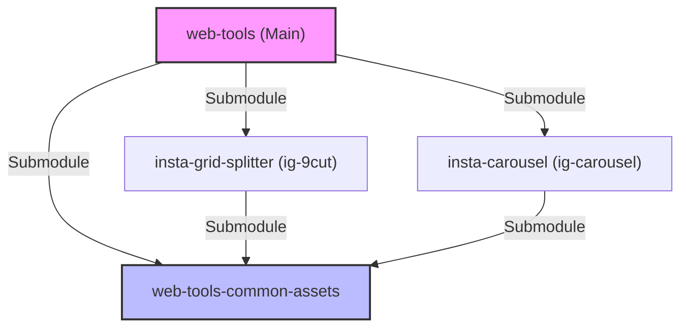

# 🛠️ SeungYong Tools Hub

**"불편해서 직접 만든"** 웹 도구 모음집입니다.  
모든 도구는 **[web-tools-common-assets](https://github.com/spencer0124/web-tools-common-assets)** 의 디자인 시스템을 공유하며, 일관된 사용자 경험을 제공합니다.

🔗 **Live Site:** [tools.seungyongcho.com](https://tools.seungyongcho.com)

---

## 📂 Tool Collection

| Tool Name | Description | Repository |
| :--- | :--- | :--- |
| **[IG 9-Cut](https://tools.seungyongcho.com/ig-9cut/)** | 인스타그램 피드 9분할/6분할 자동 생성기 | [Go to Repo](https://github.com/spencer0124/insta-grid-splitter) |
| **[IG Carousel](https://tools.seungyongcho.com/ig-carousel/)** | 인스타그램 파노라마 사진 이어붙이기 | [Go to Repo](https://github.com/spencer0124/insta-carousel) |

---

## 🏗️ Architecture

이 프로젝트는 **Hub & Spoke** 구조로 되어 있습니다.

- **[web-tools](https://github.com/spencer0124/web-tools)**: 전체 사이트를 배포하는 메인 컨테이너입니다.
- **[web-tools-common-assets](https://github.com/spencer0124/web-tools-common-assets)**: 모든 툴이 공유하는 디자인(CSS)과 로직(JS) 본부입니다.
- **Individual Tools**: 각 툴은 독립된 레포지토리이며, `common-assets`를 서브모듈로 가져와 사용합니다.

